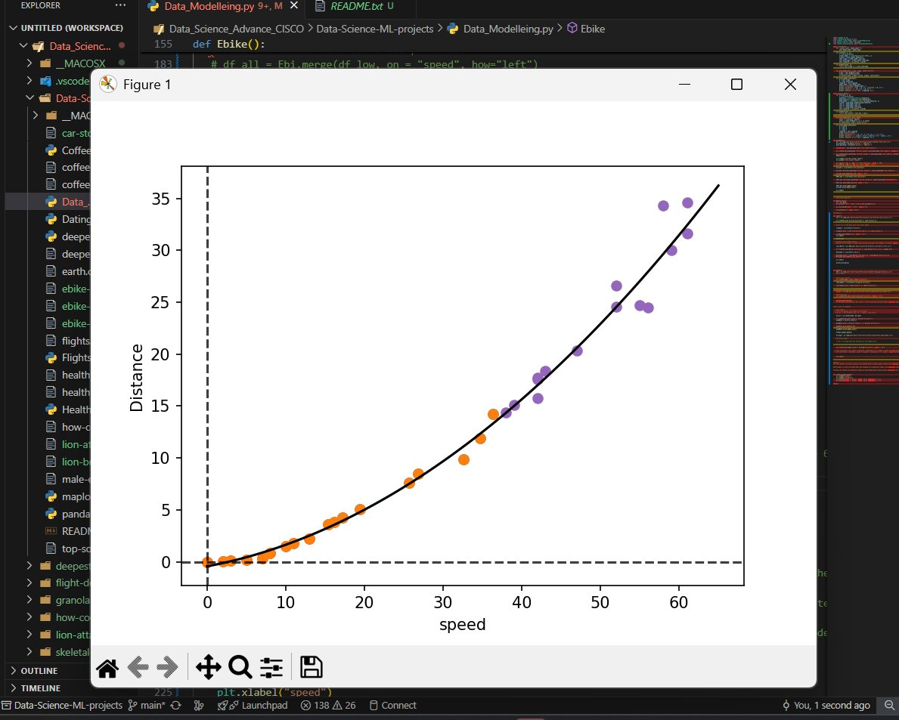
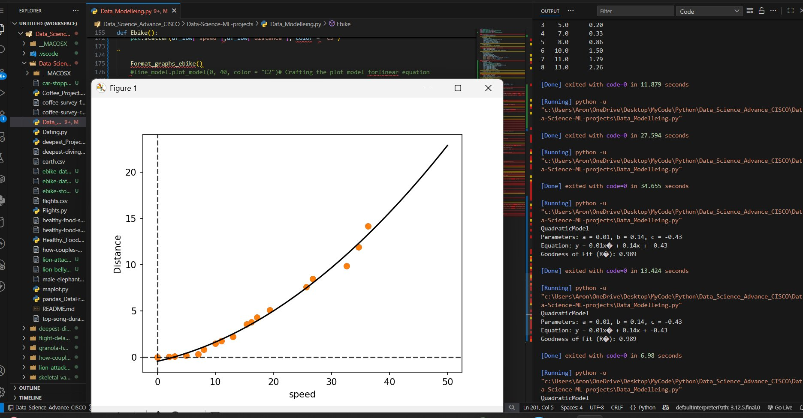

# Data Science & Machine Learning Projects

Welcome to the **Data Science & ML Projects** collection!  
This repository contains a variety of hands-on projects, datasets, and scripts that explore real-world data science and machine learning concepts using Python and popular libraries such as pandas, matplotlib, and scikit-learn.

---

## 📂 Project Structure

- **Data_Modelleing.py**  
  Explore linear and quadratic regression models on real datasets (e.g., elephant tusk sizes, e-bike stopping distances). Includes model fitting, plotting, and evaluation.

- **Data_Storytelling.py**  
  Visualize trends in animal-related word usage over time, using line plots and annotation to tell compelling data stories.

- **Dating.py**  
  Analyze and visualize how couples met over decades, using grouped bar and line plots to show social trends.

- **deepest_Project.py**  
  Investigate the deepest-diving animals, compare categories, and visualize maximum depths.

- **Flights.py**  
  Analyze flight schedules and delays, including time series and delay calculations.

- **Healthy._Food.py**  
  Compare expert and public opinions on healthy foods, visualize agreement/disagreement, and highlight trends.

- **maplot.py**  
  (Presumably) Contains custom plotting utilities or map visualizations.

- **pandas_DataFrame.py**  
  Practice and demonstrate pandas DataFrame manipulations and analysis.

---

## 📊 Datasets

- **animal-word-trends-*.csv**  
  Datasets tracking the frequency of animal-related words in print over time.

- **coffee-survey-*.csv**  
  Survey results on coffee preferences and habits.

- **deepest-diving-animals.csv**  
  Data on various animals and their maximum recorded dive depths.

- **ebike-data-*.csv**  
  E-bike speed, distance, and stopping distance data for modeling and prediction.

- **flights.csv**  
  Flight schedule and actual time data for delay analysis.

- **healthy-food-survey-*.csv**  
  Survey data on perceptions of healthy foods from both experts and the public.

- **how-couples-met.csv**  
  Data on how couples met, categorized by decade and method.

- **lion-*.csv**  
  Data on lion attacks and belly sizes, possibly for ecological or behavioral analysis.

- **male-elephant-tusk-size.csv**  
  Measurements of elephant tusk sizes before and after poaching periods.

- **top-song-durations.csv**  
  Data on the duration of top songs, possibly for music trend analysis.

---

## 🛠️ Technologies Used

- **Python 3**
- **pandas** for data manipulation
- **matplotlib** for visualization
- **scikit-learn** for machine learning models

---

## 🚀 How to Use

1. **Clone the repository**  
   ```sh
   git clone <your-repo-url>
   cd Data-Science-ML-projects
   ```

2. **Install dependencies**  
   ```sh
   pip install pandas matplotlib scikit-learn
   ```

3. **Run any script**  
   Open a script (e.g., `Data_Modelleing.py`) in your IDE or run from the terminal:
   ```sh
   python Data_Modelleing.py
   ```

---

## 💡 Project Highlights

- **Storytelling with Data:**  
  Each project is designed to not just analyze data, but to communicate insights visually and narratively.

- **Real-World Datasets:**  
  All datasets are based on real or realistic scenarios, making the projects practical and relevant.

- **Modular Code:**  
  Functions and classes are organized for easy reuse and extension.

---

## Pictures



--- 

## 📚 Learning Goals

- Practice data cleaning, transformation, and visualization.
- Build and evaluate regression models.
- Tell compelling stories with data.
- Explore trends in ecology, transportation, music, and more.

---

## 🤝 Contributions

Contributions, suggestions, and feedback are welcome!  
Feel free to fork the repo, open issues, or submit pull requests.

---

**Happy Coding & Data Exploring!**
